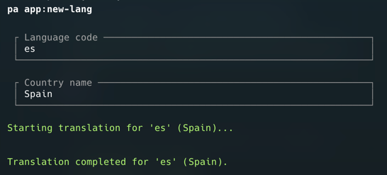

# LaraPolyglotAI

A Laravel package for creating new language folders and auto-translating them using OpenAI.

Translate your application using OpenAI via artisan command easily.



## Installation

You can install the package via composer:

```bash
composer require webzow/larapolyglotai @dev
```

Require publish the config file with:

```bash
php artisan vendor:publish --tag="larapolyglotai-config"
```

This is the contents of the published config file:

### Configure with your OpenAI API key and the origin path.

```php
return [

    /**
     * The lang where the translations will be copied.
     */
    'origin_path' => 'pt_BR',

    /**
     * The OpenAI API key.
     */
    'openaikey' => env('OPENAI_API_KEY'),
];
```

## Usage

```bash
php artisan app:new-lang
```

## Changelog

Please see [CHANGELOG](CHANGELOG.md) for more information on what has changed recently.

## Credits

- [Lucas Silva](https://webzow.com/)

## License

The MIT License (MIT). Please see [License File](LICENSE.md) for more information.
